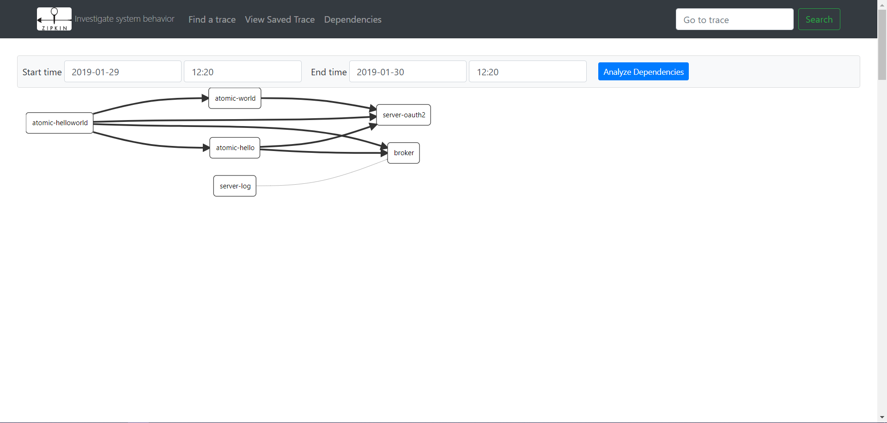

# acp-admin-cloud
###### v3.0.6 [版本更新日志](doc/version_history.md)
- 使用Application Construction Platform 应用构建平台作为脚手架
- 基于 Spring Cloud
- 该项目是前后端分离架构中的“后端部分”。前端工程[请移步](https://github.com/zhangbin1010/acp-admin)

## 相关组件版本
- [Spring Boot 2.1.7.RELEASE](https://projects.spring.io/spring-boot)
- [Spring Cloud Greenwich.SR2](http://projects.spring.io/spring-cloud)
- [Acp 6.1.5](https://github.com/zhangbin1010/acp)

## 技术栈
- flowable
- joda-time
- okhttp
- netty
- xstream
- hibernate
- jackson
- poi
- freemarker
- flying-saucer-pdf-itext5
- swagger2
- junit5
- spring-cloud
    - spring-boot
        - spring-aop
        - spring-data-jpa
        - spring-security
        - spring-security-oauth2
        - spring-data-redis
        - spring-boot-actuator
    - spring-data-redis-reactive
    - spring-boot-admin-server
    - spring-cloud-netflix-eureka-server
    - spring-cloud-netflix-eureka-client
    - spring-cloud-netflix-hystrix
    - spring-cloud-netflix-dashboard
    - spring-cloud-netflix-turbine
    - spring-cloud-gateway
    - spring-cloud-stream-binder-kafka
    - spring-cloud-openfeign
    - spring-cloud-sleuth-zipkin
    - spring-cloud-config-server
    - spring-cloud-bus-kafka

## 总体架构


#### 说明
> - 各服务在 **eureka server** 上进行注册，**gateway** 和其他各个服务通过 **eureka** 发现和查找目标服务进行访问
> - 各深度定制开发的服务从 **config server** 中获取自定义配置信息
> - 各服务将互相调用的断路信息通过 **admin server** 进行监控
> - **【依赖中间件 redis】 gateway server** 根据制定的策略路由到指定服务；路由定义从 **Redis** 获取，缓存至本地；基于动态路由配置可根据实际情况扩展实现灰度发布
> - **【依赖中间件 redis、kafka】 route server** 修改路由信息后更新至 **Redis** ，通过 **Kafka** 通知 **gateway server** 动态更新路由
> - **【依赖中间件 kafka】 oauth server** 修改应用配置和参数配置后通过 **Kafka** 推送 **Bus** 总线事件，广播通知所有 **oauth server** 更新缓存
> - **【依赖中间件 kafka】** 各深度定制开发的服务通过 **kafka** 发送日志消息，**log server** 从 **Kafka** 中消费消息并进行日志的统一记录
> - **【依赖中间件 kafka、logstash、elasticsearch】 log server** 不仅将日志信息记录在本地，还发送给 **elasticsearch** 进行汇总
> - **【依赖中间件 kafka】 config refresh server** 通过 **Kafka** 发送 **Bus** 总线事件，广播给所有其余服务进行配置刷新
> - **【依赖中间件 kafka、zipkin、zipkin-dependencies、elasticsearch】** 各服务将互相调用的链路信息通过 **Kafka** 发送给 **zipkin server**
> - **【依赖中间件 redis】** 包路径中包含 **Redis** 时，**oauth server** 将 **token** 信息持久化到 **Redis** 进行统一认证管理，否则仅持久化到内存
> - **【依赖中间件 redis】** 分布式锁，实现 **pers.acp.spring.cloud.lock.DistributedLock** 接口，并注册为**Spring Bean**，包路径中包含 **spring-data-redis** 时，默认配置一个基于 **Redis** 的分布式锁实现
> - 需要进行防重请求的 controller 方法上增加注解 **pers.acp.spring.cloud.annotation.AcpCloudDuplicateSubmission**，默认30秒过期
> - 前后端交互 **HttpStatus Code** 说明
> 
>     | HttpStatus | 描述 |
>     | --- | --- | 
>     | 200 | 请求成功 |
>     | 201 | 资源创建成功 |
>     | 400 | 业务错误 |
>     | 401 | token（登录）失效 |
>     | 403 | 权限不足 |
>     | 404 | 找不到资源 |
>     | 500 | 系统异常 |

## 一、环境要求
- jdk 11
- gradle 5.6
- kotlin 1.3.50

## 二、gradle 配置及使用
### （一）配置文件
##### 1.gradle/dependencies.gradle
定义外部依赖版本号
    
##### 2.settings.gradle
定义项目/模块结构

##### 3.gradle.properties
gradle全局参数：
- gradleVersion：gradle版本号
- group：对应打包时的groupid
- version：工程版本号
- encoding：编译字符集
- mavenCentralUrl：maven中央仓库地址
- org.gradle.jvmargs：gradle执行时的jvm参数
- javaVersion：jdk版本号
- kotlinVersion：kotlin版本号
    
##### 4.build.gradle
公共构建脚本
    
##### 5.模块根路径/build.gradle
单个模块特有的构建脚本

### （二）自定义任务
- clearPj 清理所有输出文件
- release 编译、打包并输出
- install 打包部署至本地 maven 仓库
- uploadArchives 打包部署至远程 maven 仓库，需自行创建文件 gradle/deploy.gradle，配置对应的参数，文件内容参考如下：
```groovy
ext {
    mavenUploadUrl = "http://localhost:8081/nexus/content/repositories/thirdparty"
    mavenUserName = "admin"
    mavenPassword = "admin123"
}
```

### （三）升级命令
```
    gradlew wrapper --gradle-version=5.6 --distribution-type=all
```

## 三、工程说明
- doc目录下的files文件夹，当需要用到时放到打包后的jar同目录下即可
- 工程全局默认使用 UTF-8 字符集
- libs 下面为 [acp](https://github.com/zhangbin1010/acp) 核心模块包
- cloud 目录下为基于 Spring Cloud 的一整套组件模块
- gradle 目录下为相关配置文件
- test 目录下为测试工程
- swagger url : /swagger-ui.html

## 四、启停 springboot 应用
- [jvm 参考参数](doc/jvm-params.txt)
- [启停脚本(Linux) server.sh](doc/script/server.sh)，根据实际情况修改第2行 APP_NAME 和第3行 JVM_PARAM 的值即可，和 SpringBoot 应用的 .jar 放在同一路径下
- [启停脚本(windows) server.bat](doc/script/server.bat)，根据实际情况修改第1行末尾需要执行的 jar 名称，和SpringBoot应用的 .jar 放在同一路径下
- Linux 命令：

|          命令         |           描述          |
| --------------------- | ----------------------- | 
| ./server.sh           | 查看可用参数            |
| ./server.sh status    | 查看系统运行状态        |
| ./server.sh start     | 启动应用                |
| ./server.sh stop      | 停止应用                |
| ./server.sh restart   | 重启应用                |

## 五、基础中间件环境搭建
基础中间件包括：redis、zookeeper、kafka、kafka-manager、elasticsearch、kibana、logstash、zipkin、zipkin-dependencies、zoonavigator-api、zoonavigator-web、prometheus、grafana、setup_grafana_datasource
> - 启动服务
> 
> 命令模式进入dockerfile目录，执行启动命令
> ```bash
> docker-compose -f docker-compose-base.yml up -d
> ```
> - 停止服务
> 
> 命令模式进入dockerfile目录，执行启动命令
> ```bash
> docker-compose -f docker-compose-base.yml stop
> ```
> - 停止并删除容器实例
> 
> 命令模式进入dockerfile目录，执行启动命令
> ```bash
> docker-compose -f docker-compose-base.yml down
> ```
> - docker-compose 文件：[dockerfiles/docker-compose-base.yml](dockerfiles/docker-compose-base.yml)

##### 1. zipkin 链路监控
http://127.0.0.1:9411

##### 2. kafka-manager kafka队列监控
http://127.0.0.1:9000

##### 3. zoonavigator zookeeper监控
http://127.0.0.1:8004

##### 4. prometheus 通过从zipkin中收集的信息进行性能监控
http://127.0.0.1:9090

##### 5. kibana elasticsearch内容管理，进行统一日志检索
http://127.0.0.1:5601


## 六、系统初始化
### （一）数据库
> - 执行 oauth-server 模块下的 pers.acp.admin.oauth.test.InitData.doInitAll() 单元测试
> - 执行 route-server 模块下的 pers.acp.admin.route.test.InitData.doInitAll() 单元测试
> - 执行 config-server 模块下的 pers.acp.admin.config.test.InitData.doInitAll() 单元测试

## 七、服务列表
### （一）[admin-server](cloud/admin-server/README.md)
###### 1 可视化监控，监控服务状态、信息聚合
|          url          |  描述                   |
| --------------------- | ----------------------- | 
| /                     | 后台监控管理首页        |
| /hystrix              | 断路信息监控            |
###### 2 zipkin 链路追踪（需依赖 kafka）
- 服务端
> 从SpringCloud2.0 以后，官方已经不支持自定义服务，官方只提供编译好的jar包供用户使用。可以自行使用多种方式部署zipkin服务，并采用elasticsearch作为zipkin的数据存储器。
- 客户端（cloud中其他需要监控链路的服务，admin-server、eureka-server、gateway-server 除外）
> - 依赖 cloud:acp-admin-cloud-dependencies
> - 增加 zipkin 相关配置
> ```yaml
> spring:
>   zipkin:
>     sender:
>       type: kafka
>   sleuth:
>     sampler:
>       probability: 1 #样本采集量，默认为0.1，为了测试这里修改为1，正式环境一般使用默认值。
> ```
### （二）eureka-server
服务注册发现

|          url          |  描述                   |
| --------------------- | ----------------------- | 
| /                     | 服务状态监控界面         |
> 服务注册发现（支持高可用eureka集群）
>（1）无需改动代码
>（2）修改 yml 配置即可
### （三）[gateway-server](cloud/gateway-server/README.md)
> 网关服务，修改 yml
> 动态路由信息保存在 redis
### （四）[config-server](cloud/config-server/README.md)
> 配置中心，配置信息存放于数据库，并支持bus广播刷新所有服务配置信息
> - 依赖 
>   - cloud:acp-admin-cloud-dependencies
>   - cloud:acp-admin-cloud-constant
### （五）[log-server](cloud/log-server/README.md)
> - 统一日志服务
> - 依赖 
>   - cloud:acp-admin-cloud-dependencies
>   - cloud:acp-admin-cloud-constant
> - 通过 kafka 收集其余服务的日志信息，统一进行记录
> - 根据 oauth 服务中运行参数配置的策略，压缩备份日志文件
> - 提供备份的日志文件查询、下载接口，只有超级管理员有权限访问
### （六）[oauth-server](cloud/oauth-server/README.md)
> - 统一认证服务
> - 依赖 
>   - cloud:acp-admin-cloud-dependencies
>   - cloud:acp-admin-cloud-constant
> - 提供全套权限体系接口
### （七）[file-server](cloud/file-server/README.md)
> - 文件服务
> - 依赖 
>   - cloud:acp-admin-cloud-dependencies
>   - cloud:acp-admin-cloud-constant
> - 提供基本的文件上传、下载服务
### （八）[route-server](cloud/route-server/README.md)
> - 路由服务
> - 依赖 
>   - cloud:acp-admin-cloud-dependencies
>   - cloud:acp-admin-cloud-constant
> - 提供动态路由策略配置及刷新接口
> - 提供路由日志信息查询接口
### （九）[workflow-server](cloud/workflow-server/README.md)
> - 工作流引擎服务
> - 依赖 
>   - cloud:acp-admin-cloud-dependencies
>   - cloud:acp-admin-cloud-constant
> - 提供工作流相关接口服务
### （十）[config-refresh-server](cloud/config-refresh-server/README.md)
> - 配置刷新服务
> - 依赖 cloud:acp-admin-cloud-dependencies
> - 接收 /actuator 管理接口，向总线发送刷新配置“事件”
### （十一）其他自定义服务
> - 依赖 cloud:acp-admin-cloud-dependencies