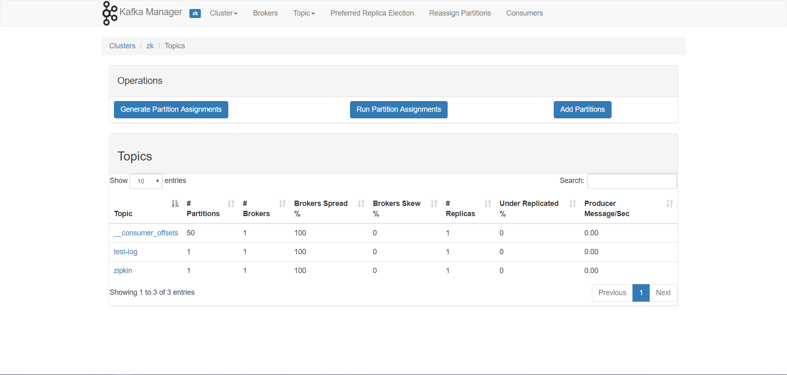
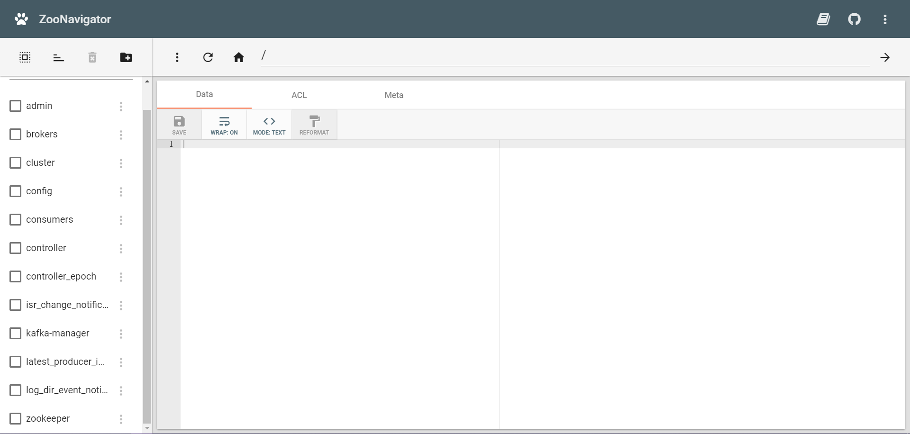
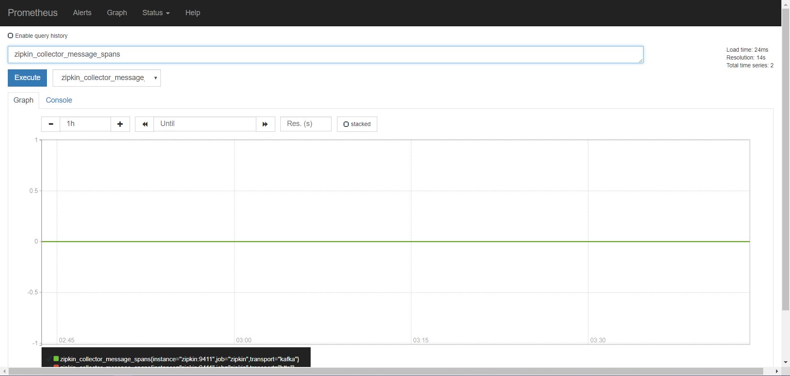
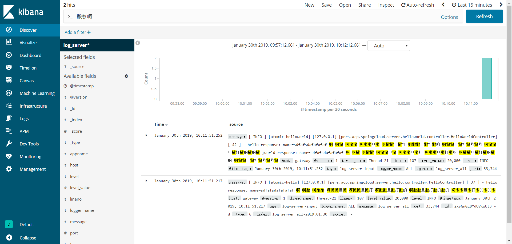

# acp-admin-cloud
###### v4.0.5 [版本更新日志](doc/version_history.md)
- 使用Application Construction Platform 应用构建平台作为脚手架
- 基于 Spring Cloud
- 该项目是前后端分离架构中的“后端部分”。前端工程[v4.0.5](https://github.com/zhangbin1010/acp-admin)

## 相关组件版本
- [Spring Boot 2.1.10.RELEASE](https://projects.spring.io/spring-boot)
- [Spring Cloud Greenwich.SR4](http://projects.spring.io/spring-cloud)
- [Spring Cloud Alibaba 2.1.1.RELEASE](https://github.com/alibaba/spring-cloud-alibaba)
- [Acp 6.3.2](https://github.com/zhangbin1010/acp)

## 技术栈
- flowable
- joda-time
- okhttp
- netty
- xstream
- hibernate
- jackson
- poi
- freemarker
- flying-saucer-pdf-itext5
- swagger2
- junit5
- Nacos
- Sentinel
- spring-cloud-alibaba
- spring-cloud
    - spring-boot
        - spring-aop
        - spring-data-jpa
        - spring-security
        - spring-security-oauth2
        - spring-data-redis
        - spring-boot-actuator
    - spring-data-redis-reactive
    - spring-boot-admin-server
    - spring-cloud-gateway
    - spring-cloud-stream-binder-kafka
    - spring-cloud-openfeign
    - spring-cloud-bus-kafka

## 总体架构


#### 说明
> - 各服务在 **Nacos** 上进行注册，**gateway** 和其他各个服务通过 **Nacos** 发现和查找目标服务进行访问
> - 各服务将互相调用的断路信息通过 **admin server** 进行监控
> - **【依赖中间件 redis】 gateway server** 根据制定的策略路由到指定服务；路由定义从 **Redis** 获取，缓存至本地；基于动态路由配置可根据实际情况扩展实现灰度发布
> - **【依赖中间件 redis、kafka】 route server** 修改路由信息后更新至 **Redis** ，通过 **Kafka** 通知 **gateway server** 动态更新路由
> - **【依赖中间件 kafka】 oauth server** 修改应用配置和参数配置后通过 **Kafka** 推送 **Bus** 总线事件，广播通知所有 **oauth server** 更新缓存
> - **【依赖中间件 kafka】** 各深度定制开发的服务通过 **kafka** 发送日志消息，**log server** 从 **Kafka** 中消费消息并进行日志的统一记录
> - **【依赖中间件 kafka、logstash、elasticsearch】 log server** 不仅将日志信息记录在本地，还发送给 **elasticsearch** 进行汇总
> - **【依赖中间件 redis】** 包路径中包含 **Redis** 时，**oauth server** 将 **token** 信息持久化到 **Redis** 进行统一认证管理，否则仅持久化到内存
> - **【依赖中间件 zookeeper】** 分布式锁，实现 **pers.acp.spring.cloud.lock.DistributedLock** 接口，并注册为**Spring Bean**，包路径中包含 **curator-recipes** 时，默认配置一个基于 **zookeeper** 的分布式锁实现
> - 需要进行防重请求的 controller 方法上增加注解 **pers.acp.spring.cloud.annotation.AcpCloudDuplicateSubmission**，默认30秒过期
> - 前后端交互 **HttpStatus Code** 说明
> 
>     | HttpStatus | 描述 |
>     | --- | --- | 
>     | 200 | 请求成功 |
>     | 201 | 资源创建成功 |
>     | 400 | 业务错误 |
>     | 401 | token（登录）失效 |
>     | 403 | 权限不足 |
>     | 404 | 找不到资源 |
>     | 500 | 系统异常 |

## 一、环境要求
- jdk 11
- gradle 6.0.1
- kotlin 1.3.60

## 二、gradle 配置及使用
### （一）配置文件
##### 1.gradle/dependencies.gradle
定义外部依赖版本号
    
##### 2.settings.gradle
定义项目/模块结构

##### 3.gradle.properties
gradle全局参数：
- gradleVersion：gradle版本号
- group：对应打包时的groupid
- version：工程版本号
- encoding：编译字符集
- mavenCentralUrl：maven中央仓库地址
- org.gradle.jvmargs：gradle执行时的jvm参数
- javaVersion：jdk版本号
- kotlinVersion：kotlin版本号
    
##### 4.build.gradle
公共构建脚本
    
##### 5.模块根路径/build.gradle
单个模块特有的构建脚本

### （二）自定义任务
- clearPj 清理所有输出文件
- release 编译、打包并输出
```groovy
ext {
    mavenUploadUrl = "http://localhost:8081/nexus/content/repositories/thirdparty"
    mavenUserName = "admin"
    mavenPassword = "admin123"
}
```

### （三）升级命令
```
    gradlew wrapper --gradle-version=6.0.1 --distribution-type=all
```

## 三、工程说明
- 工程全局默认使用 UTF-8 字符集
- gradle 目录下为相关配置文件
- libs 下面为 [acp](https://github.com/zhangbin1010/acp) 核心模块包
- common 目录下为基于 Spring Cloud 的基础组件模块，含 Spring Boot Admin 和 GateWay
- cloud 目录下为基于 Spring Cloud 的自定义组件模块
- dockerfiles 所使用的中间件[docker-compose-base.yaml](dockerfiles/docker-compose-base.yaml)
- [数据库表结构](doc/数据结构.docx)
- swagger url : /swagger-ui.html

## 四、启停 SpringBoot 应用
- [jvm 参考参数](doc/jvm-params.txt)
- [启停脚本模板(Linux)](doc/script/server.model)，根据实际情况修改第2行 APP_NAME 和第3行 JVM_PARAM 的值即可，和 SpringBoot 应用的 .jar 放在同一路径下
- [启停脚本(windows)](doc/script/server.bat)，根据实际情况修改第1行末尾需要执行的 jar 名称，和SpringBoot应用的 .jar 放在同一路径下
- windows：修改[server.bat](doc/script/server.bat)内相关参数后，直接运行即可
- Linux 命令：

|          命令         |           描述          |
| --------------------- | ----------------------- | 
| ./server.sh           | 查看可用参数            |
| ./server.sh status    | 查看系统运行状态        |
| ./server.sh start     | 启动应用                |
| ./server.sh stop      | 停止应用                |
| ./server.sh restart   | 重启应用                |

## 五、基础中间件环境搭建
基础中间件包括：redis、zookeeper、kafka-manager、elasticsearch、kibana、logstash、zoonavigator-api、zoonavigator-web、prometheus、grafana、setup_grafana_datasource
> - 启动服务
> 
> 命令模式进入dockerfile目录，执行启动命令
> ```bash
> docker-compose -f docker-compose-base.yaml up -d
> ```
> - 停止服务
> 
> 命令模式进入dockerfile目录，执行启动命令
> ```bash
> docker-compose -f docker-compose-base.yaml stop
> ```
> - 停止并删除容器实例
> 
> 命令模式进入dockerfile目录，执行启动命令
> ```bash
> docker-compose -f docker-compose-base.yaml down
> ```
> - docker-compose 文件：[dockerfiles/docker-compose-base.yaml](dockerfiles/docker-compose-base.yaml)

##### 1. kafka-manager kafka队列监控
http://127.0.0.1:9000

##### 2. zoonavigator zookeeper监控
http://127.0.0.1:8004

##### 3. prometheus 通过从zipkin中收集的信息进行性能监控
http://127.0.0.1:9090

##### 4. kibana elasticsearch内容管理，进行统一日志检索
http://127.0.0.1:5601


## 六、需独立部署的必要组件及监控
### （一）Nacos
> - 用作服务注册/发现中心，配置中心，详情请参考[官网](https://nacos.io/zh-cn/)
> - 独立部署，数据库仅支持 MySQL5.6或5.7
> - 控制台 http://ip:port/nacos
> - 使用时需导入初始化配置信息[doc/nacos_config_export_2019-10-29 18_41_13.zip](doc/nacos_config_export_2019-10-29 18_41_13.zip)
> - 可监控服务健康状况，管理服务优雅上下线。进行配置项的统一管理、维护、分发

### （二）Kafka
> - 由于最新版kafka需要绑定访问IP，部署于docker中时总是出现外部无法访问的情况（暂时没有解决方案），因此需要单独安装部署
> - 详情请参考[官网](http://kafka.apache.org/)
> - 使用[docker-compose-base.yaml](dockerfiles/docker-compose-base.yaml)中部署的zookeeper

### （三）Zipkin
> - 配合 Spring Cloud Sleuth 进行服务链路追踪分析、统计，Zipkin Server 需要自行安装部署，详情请参考[官网](https://zipkin.io/)
> - 使用方法：
>   - 添加依赖
>        ```groovy
>        implementation "org.springframework.cloud:spring-cloud-starter-zipkin"
>        ```
>   - bootstrap.yaml 增加配置
>        ```yaml
>        spring:
>          zipkin:
>            sender:
>              type: kafka #默认为http方式，建议使用kafka方式发送链路追踪信息
>        ```
>   - application-xxx.yaml 增加配置
>        ```yaml
>        spring:
>          sleuth:
>            sampler:
>              probability: 1 #样本采集率，默认0.1，测试环境可以配置为1，生产为了不影响系统能行建议维持默认
>        ```
>   - 进行如上配置之后，服务就会自行向kafka推送链路信息
> - 控制台 http://ip:port/zipkin
> - 可监控请求链路 traces、消耗时间、服务依赖关系图等

## 七、系统初始化
### （一）数据库
> - 执行 oauth-server 模块下的 pers.acp.admin.oauth.nobuild.InitData.doInitAll() 单元测试
> - 执行 route-server 模块下的 pers.acp.admin.route.nobuild.InitData.doInitAll() 单元测试
> - [数据库表结构](doc/数据结构.docx)

## 八、服务列表
### （一）[admin-server](common/admin-server/README.md)
可视化监控，监控服务状态
### （二）acp-admin-cloud-constant
> 全局静态常量定义
> 定义服务间内部访问restful路径
> 定义角色编码
> 定义功能权限编码
> 定义路由相关常量
> 定义token相关常量
### （三）[gateway-server](common/gateway-server/README.md)
> - 网关服务
> - 依赖，请查看[build.gradle](common/gateway-server/build.gradle)
> - 动态路由信息保存在 redis
### （四）acp-admin-cloud-dependencies
> - 组件依赖模块
> - controller、domain、feign hystrix、repository 等基类和接口定义
> - 分布式锁实现
> - 全局流水号生成实现
> - 自动配置相关组件
> - 依赖
>   - acp-spring-cloud-starter
>   - spring-boot-starter-data-jpa
>   - spring-boot-starter-data-redis
>   - curator-recipes
>   - cloud:acp-admin-cloud-constant
### （五）[log-server](cloud/log-server/README.md)
> - 统一日志服务
> - 依赖 
>   - cloud:acp-admin-cloud-dependencies
> - 通过 kafka 收集其余服务的日志信息，统一进行记录
> - 通过 kafka 收集网关消息，记录路由日志
> - 根据配置中心参数，压缩备份日志文件
> - 根据配置中心参数，记录操作日志和登录日志
> - 每日将路由日志、操作日志、登录日志迁移至历史库
> - 根据 oauth 服务中运行参数配置的策略，压缩备份日志文件
> - 提供备份的日志文件查询、下载接口，只有超级管理员有权限访问
### （六）[oauth-server](cloud/oauth-server/README.md)
> - 统一认证服务
> - 依赖 
>   - cloud:acp-admin-cloud-dependencies
> - 提供全套权限体系服务，包含客户端应用管理、用户管理、机构管理、角色管理、权限管理、token管理、运行参数管理等
### （七）[route-server](cloud/route-server/README.md)
> - 路由服务
> - 依赖 
>   - cloud:acp-admin-cloud-dependencies
> - 提供动态路由策略配置及刷新
### （八）[workflow-server](cloud/workflow-server/README.md)
> - 工作流引擎服务
> - 依赖 
>   - cloud:acp-admin-cloud-dependencies
> - 提供工作流相关接口服务
### （九）其他自定义服务
> - 依赖
>   - cloud:acp-admin-cloud-dependencies

## 九、[Sentinel 动态数据源配置](doc/sentinel.md)