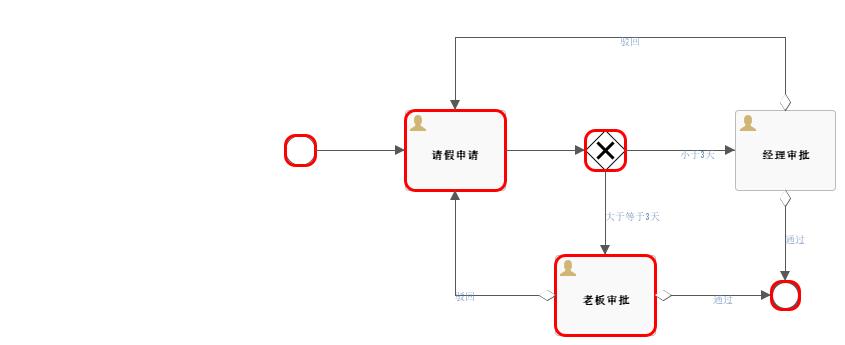

### workflow-server

工作流服务，集成[Flowable](https://www.flowable.org)工作流引擎，详情请看[参考文档](https://www.flowable.org/docs/userguide/index.html)

##### 一、操作系统增加字体文件

###### （一）windows

无需添加，已自带字体

###### （二）linux

将宋体字体文件[simsun.ttc](src/main/resources/libs/simsun.ttc)复制到Linux服务器上的 $JAVA_HOME/lib/fonts 路径即可

```
 cd $JAVA_HOME/lib
 mkdir fonts
 cd $JAVA_HOME/lib/fonts
```

##### 二、流程编辑器

- 1、请前往flowable[官网](https://www.flowable.org)或[GitHub](https://github.com/flowable/flowable-engine/releases)下载并部署
  flowable-modeler 至 tomcat9 并启动
- 2、或者下载docker镜像 flowable/all-in-one 并启动

```
docker run -p8080:8080 flowable/all-in-one
```

- 3、浏览器打开网址 http://localhost:8080/flowable-modeler
- 4、登录用户名及密码：admin/test
- 5、编辑好一个流程之后，导出为 xxxx.bpmn20.xml 文件

##### 三、流程部署

- 1、流程更新重新部署后，只有新发起的流程会使用新流程，之前尚未结束的流程，仍然走老版本的流程
- 2、管理界面进行工作流部署，上传 xxxx.bpmn20.xml 文件

##### 四、接口说明

- 1、工作流服务目前已封装如下5个接口，接口详情请在浏览器中访问 /doc.html 页面
    - 启动流程
    - 获取用户待办任务列表
    - 流程处理
    - 流程处理历史查询
    - 生成流程图
- 2、需动态配置路由策略。

##### 五、固定必要的流程变量，自定义变量不能与之重复

- startUserId - 流程发起人
- businessKey - 业务键
- flowName - 流程名称
- title - 流程标题
- description - 流程描述
- pass - 处理结果：true-通过，false-不通过
- comment - 处理意见
- candidateUser:String ，节点任务候选人ID（一人或多人），多个候选人时使用“,”分隔；任务处理完成后需修改（变更为下一节点人或置空）
- assigneeUser:String ，节点任务处理人ID（只能一人）；任务处理完成后需修改（变更为下一节点人或置空）

##### 六、内置任务动态表单字段

- isTermination:Boolean ，当前任务节点是否可以进行终止操作（流程强制结束）
- isTransfer:Boolean ，当前任务是否可以转办（任务处理人变更，处理完毕后进入下一节点）
- isDelegate:Boolean ，当前任务是否可以委派他人办理（任务处理人变更，处理完毕后返回至当前处理人继续办理）
- selectUser:Boolean ，是否手动选择分配处理人（或候选人）
- orgLevel:Int ，待发送用户部门级别，负数|零|正数；0-当前用户所在部门，-1上一级部门，-2上两级部门...依次类推，1下一级部门，2下两级部门...依次类推，多个code时使用“,”分隔
- roleCode:String ，待发送用户所属角色code，多个code时使用“,”分隔
- taskCode:String ，任务编码，用于自定义判断任务处理方式
- isReject:Boolean ，当前任务是否允许驳回
- rejectToTask:String ，驳回至目标任务的定义ID，多个值时使用“,”分隔

##### 七、流程示例

- 流程图：
  

##### 八、附加环境变量及启动参数

| 变量名             | 描述            | 默认值 | 说明                                                                            |
|-----------------|---------------|-----|-------------------------------------------------------------------------------|
| LD_LIBRARY_PATH | JVM的library路径 | -   | 配置为服务的部署路径，虚拟机部署时需设置```export LD_LIBRARY_PATH=$LD_LIBRARY_PATH:[部署路径]/libs``` |

##### 九、自定义待办通知开发

- 待办生成通知：新建通知处理类，包名pers.acp.admin.workflow.notify，继承```pers.acp.admin.workflow.base.PendingCreatedNotify```，实现方法
  ```
  @Throws(ServerException::class)
  fun doTaskNotify(taskId: String, userIdList: List<String>)
  ```
  参考[TestPendingCreatedNotify](src/main/kotlin/pers/acp/admin/workflow/notify/TestPendingCreatedNotify.kt)
- 待办完成通知：新建通知处理类，包名pers.acp.admin.workflow.notify，继承```pers.acp.admin.workflow.base.PendingFinishedNotify```，实现方法
  ```
  @Throws(ServerException::class)
  fun doTaskNotify(taskId: String, userIdList: List<String>)
  ```
  参考[TestPendingFinishedNotify](src/main/kotlin/pers/acp/admin/workflow/notify/TestPendingFinishedNotify.kt)

##### 十、容器中部署时，镜像需安装如下组件

> - bzip2-libs-1.0.6-13.el7.i686.rpm
> - libblkid-devel-2.23.2-65.el7_9.1.x86_64.rpm
> - nspr-4.25.0-2.el7_9.x86_64.rpm
> - dejavu-fonts-common-2.33-6.el7.noarch.rpm
> - libmount-2.23.2-65.el7_9.1.x86_64.rpm
> - nss-softokn-freebl-3.53.1-6.el7_9.i686.rpm
> - dejavu-sans-fonts-2.33-6.el7.noarch.rpm
> - glibc-2.17-324.el7_9.i686.rpm
> - libpng-1.5.13-8.el7.i686.rpm
> - nss-softokn-freebl-3.53.1-6.el7_9.x86_64.rpm
> - expat-2.1.0-12.el7.i686.rpm
> - glibc-2.17-324.el7_9.x86_64.rpm
> - libpng-1.5.13-8.el7.x86_64.rpm
> - nss-util-3.53.1-1.el7_9.x86_64.rpm
> - expat-2.1.0-12.el7.x86_64.rpm
> - glibc-common-2.17-324.el7_9.x86_64.rpm
> - libsmartcols-2.23.2-65.el7_9.1.x86_64.rpm
> - util-linux-2.23.2-65.el7_9.1.x86_64.rpm
> - glibc-devel-2.17-324.el7_9.x86_64.rpm
> - libuuid-2.23.2-65.el7_9.1.i686.rpm
> - glibc-headers-2.17-324.el7_9.x86_64.rpm
> - libuuid-2.23.2-65.el7_9.1.x86_64.rpm
> - fontpackages-filesystem-1.44-8.el7.noarch.rpm
> - libblkid-2.23.2-65.el7_9.1.x86_64.rpm
> - libuuid-devel-2.23.2-65.el7_9.1.x86_64.rpm
> - **freetype-2.8-14.el7_9.1.i686.rpm**
> - **freetype-2.8-14.el7_9.1.x86_64.rpm**
> - **zlib-1.2.7-19.el7_9.i686.rpm**
> - **fontconfig-2.13.0-4.3.el7.x86_64.rpm**
> - **fontconfig-2.13.0-4.3.el7.i686.rpm**